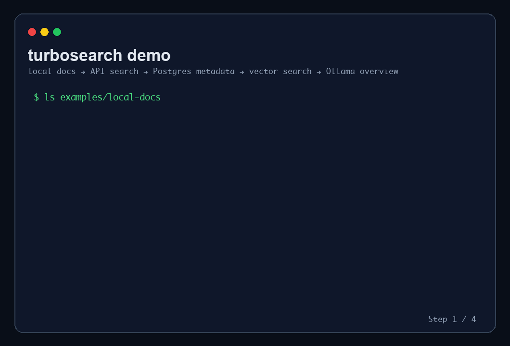
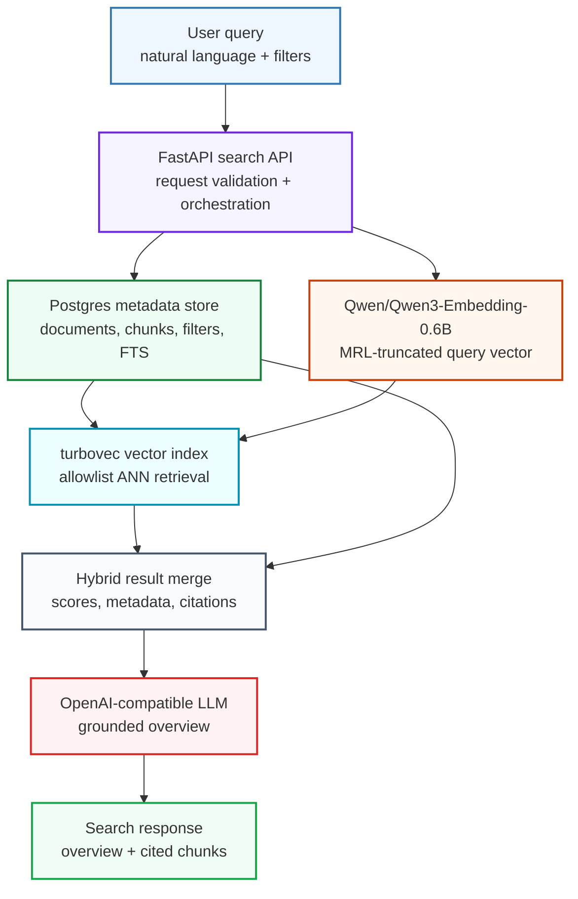

# turbosearch


Fast semantic search and cited AI overviews for your own document collections, built on a Postgres + turbovec architecture.

`turbosearch` is a local-first retrieval stack for private corpora, research libraries, knowledge bases, archives, and public-domain examples. It combines Postgres metadata filtering, [turbovec](https://github.com/RyanCodrai/turbovec) vector retrieval, Qwen embeddings, and an OpenAI-compatible LLM summary layer so users can find passages faster and understand why the results matter.

`turbovec` is a Rust/Python vector index built on Google Research's [TurboQuant](https://research.google/blog/turboquant-redefining-ai-efficiency-with-extreme-compression/) work, which focuses on compact online vector quantization with near-optimal distortion.





## Goals

- Search your own documents by meaning, not just exact keywords.
- Keep Postgres as the durable source of truth for documents, chunks, metadata, filters, and lexical search.
- Use [turbovec](https://github.com/RyanCodrai/turbovec) as the fast local ANN layer, with Postgres-provided allowlists for filtered search.
- Use `Qwen/Qwen3-Embedding-0.6B` for local, high-quality embeddings with MRL truncation for speed and memory control.
- Generate LLM summaries immediately, with citations back to exact passages and source URLs.
- Prove everything locally before deploying Aurora PostgreSQL + EC2 on AWS.

## Stack

| Layer | Local | AWS |
|---|---|---|
| API | FastAPI on Docker Compose | EC2 systemd service |
| Metadata | PostgreSQL 16 | Aurora PostgreSQL |
| Vector index | turbovec in-process/host sidecar | turbovec on EC2 |
| Embeddings | Qwen3-Embedding-0.6B | Qwen3-Embedding-0.6B on EC2 |
| Summary | host-installed Ollama, OpenAI-compatible API | Emberlane OpenAI-compatible endpoint |
| Corpus | local files, URLs, or example documents | S3/object storage ingestion jobs |

## Local Run

```bash
cp .env.example .env
ollama pull qwen3:0.6b
docker compose up --build
```

If Ollama is not already running as a desktop app or service, start it in a separate shell with `ollama serve` before `docker compose up`.

In another shell:

```bash
docker compose exec api turbosearch init-db
docker compose exec api turbosearch ingest-dir ./examples/local-docs
docker compose exec api turbosearch search "Which document mentions semantic retrieval?"
```

API:

```bash
curl "http://localhost:8000/search?q=semantic%20retrieval%20metadata"
```

The API container reaches your host-installed Ollama through `http://host.docker.internal:11434/v1`. The first embedding run downloads `Qwen/Qwen3-Embedding-0.6B`, so expect a slower cold start.

## Local Smoke Test

```bash
docker compose exec api python scripts/e2e_local.py
```

Or run the same flow through `make`:

```bash
make e2e-local
```

The smoke path initializes Postgres, ingests `examples/local-docs`, builds/upserts local vector entries, runs search queries, and asks the configured LLM endpoint for summaries.

`make e2e-local` uses the deterministic local embedder so the full Docker smoke test stays quick and reproducible. It still calls your host-installed Ollama for the LLM overview. Set `EMBEDDING_PROVIDER=qwen` when you want the higher-quality Qwen embedding path.

## Example Data

The example files under `examples/local-docs` are intentionally tiny and generic so the full stack can be tested quickly. You can index your own local files with `turbosearch ingest-dir ./path/to/docs`; `.txt`, `.md`, and `.markdown` files are read recursively.

You can also ingest through the API:

```bash
curl -X POST "http://localhost:8000/ingest/text" \
  -H "Content-Type: application/json" \
  -d '{"title":"My Note","text":"Turbosearch can index text sent directly to the API."}'

curl -X POST "http://localhost:8000/ingest/url" \
  -H "Content-Type: application/json" \
  -d '{"title":"Example Remote Text","url":"https://example.com/document.txt"}'
```

For public-domain demos, `examples/project-gutenberg/urls.json` contains example documents from Project Gutenberg. Turbosearch is not tied to Gutenberg; those URLs are just sample inputs for the URL ingestion API.

## AWS Deploy

For cloud summaries, deploy Emberlane first and use its OpenAI-compatible endpoint. I would start with the `qwen35_9b_awq` profile: Emberlane maps it to `QuantTrio/Qwen3.5-9B-AWQ` on `g6e.2xlarge`, which is a strong quality step-up for overview generation without carrying the full unquantized memory footprint.

From the Emberlane repo:

```bash
cargo run -- aws credentials check --profile your-profile
cargo run -- aws init --profile your-profile
cargo run -- aws deploy --profile your-profile --model qwen35_9b_awq --mode balanced
cargo run -- aws print-config --profile your-profile
```

Then pass the Emberlane endpoint into turbosearch:

```bash
cd infra/terraform
terraform init
terraform apply \
  -var 'db_password=replace-with-a-long-random-password' \
  -var 'llm_base_url=https://your-emberlane-endpoint/v1' \
  -var 'llm_api_key=your-emberlane-key' \
  -var 'llm_model=qwen35_9b_awq'
```

Terraform provisions:

- VPC, public/private subnets, and security groups
- Aurora PostgreSQL for metadata and filtering
- EC2 for API, Qwen embeddings, and turbovec
- S3 document bucket for uploaded `.txt` and `.md` files
- User-data bootstrap for Python dependencies and the API service

After apply, validate the service URL from Terraform output:

```bash
terraform output app_url
curl "$(terraform output -raw app_url)/health"
```

Upload documents and trigger S3 ingestion:

```bash
aws s3 cp ./docs "s3://$(terraform output -raw document_bucket_name)/docs/" --recursive
curl -X POST "$(terraform output -raw app_url)/ingest/s3" \
  -H "Content-Type: application/json" \
  -d '{"prefix":"docs/"}'
curl "$(terraform output -raw app_url)/search?q=your%20query"
```

The EC2 user-data script installs the service and runtime dependencies. Add SSM Session Manager or an SSH key pair before running manual commands on the instance.

## Design Notes

Postgres stores `documents` and `chunks`, including `vector_key`, `embedding_model`, `embedding_dim`, and `index_version`. It does not store vector columns. turbovec owns dense retrieval and receives allowlists from Postgres when filters are selective.

Search flow:

1. Postgres narrows candidates with metadata, ACL, source, language, and full-text filters.
2. Qwen embeds the query.
3. turbovec searches the candidate vector keys.
4. The API merges scores, fetches chunk metadata, and assembles citations.
5. The LLM writes a concise overview grounded in the top passages.

## License

MIT
